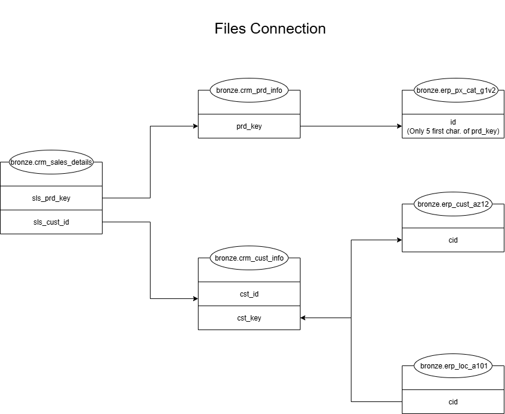

# Sales Data Medallion DW

**Data Warehouse Project (Medallion Architecture)**

This project demonstrates the design and implementation of a modern **Data Warehouse** using the **Medallion Architecture**. It ingests data from **CRM** and **ERP** CSV sources, processes data through **Bronze (raw)**, **Silver (cleansed)**, and **Gold (business)** layers, and produces **analytics-ready data models**.

---

## Architecture Overview

The solution is structured using the **industry-standard Medallion Architecture**:

- **Bronze Layer:** Raw data ingestion from CSV files with no transformation.  
- **Silver Layer:** Cleansing, normalization, standardization, and enrichment of data.  
- **Gold Layer:** Business views, aggregations, and star schema models for analytics.

The project includes clear mapping of how different source files relate within the Bronze layer:

---

## Project Files

| File | Description |
|------|-------------|
| `Init_SalesDataWarehouse.sql` | Creates the data warehouse and required schemas. |
| `ddl_bronze_layer.sql` | DDL statements for Bronze layer tables. |
| `ddl_silver_layer.sql` | DDL statements for Silver layer tables. |
| `ddl_gold_layer.sql` | DDL statements for Gold layer business views. |
| `procedure_bronze_layer.sql` | Procedures for loading raw data into Bronze tables. |
| `procedure_silver_layer.sql` | Procedures for transforming and loading data into Silver tables. |

---

## How to Use

### 1. Initialize the Database
Run `Init_SalesDataWarehouse.sql` to create the data warehouse and schemas.

### 2. Create Tables and Views
Run DDL scripts for Bronze, Silver, and Gold layers **in order**:

